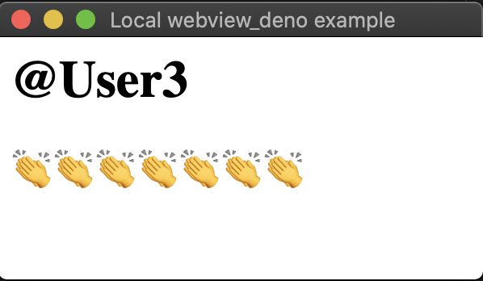

# Mention
Randomly pick something. Display is done by WebView


## Get started
First, please write your configuration.
```Shell
$ cp config/default_template.yml config/default.yml
$ vi config/default.yml # TODO mention target
```
Second, deno run.
```Shell
$ deno run -A --unstable app.ts

# or 

$ deno run --allow-env --allow-read --allow-write --allow-plugin --unstable app.ts
```
